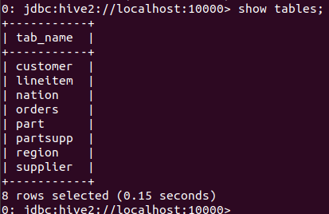
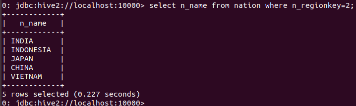
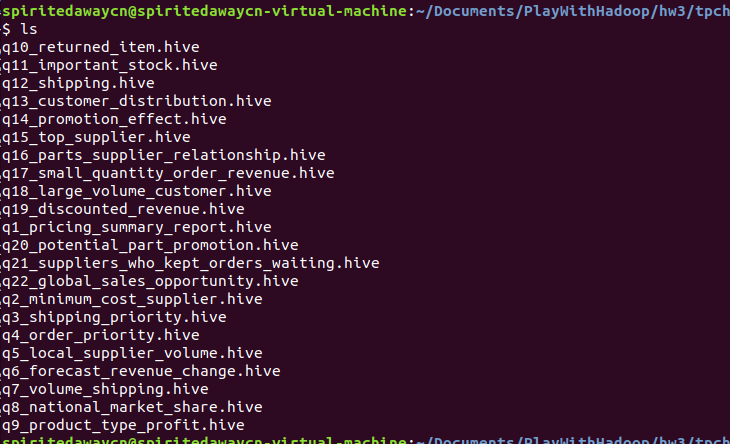
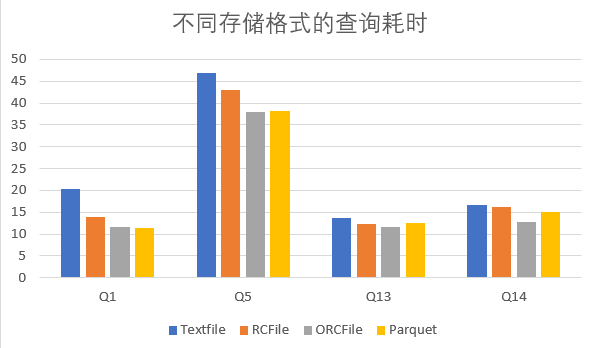

## 大数据管理技术 第三次小组实习

<div style="text-align: center">林汇平 1800013104 | 奚佳琪 1800012923</small></div>

<div style="text-align: center"> 项目链接：<a href="https://github.com/phoenixrain-pku/BigDataSummer" target="_blank">https://github.com/phoenixrain-pku/BigDataSummer</a><br /></small></div>

+ 实习要求：

  1. 利用京东和阿里的用户购物数据集，自己利用Hive完成用户购物行为分析，可以参考附件中的实习四。

  2. 基于Hive完成TPC-H性能测试，助教会提供相应的生成测试数据集和查询集的代码工具，自己从中选择一组有代表性的查询。测试时可以关注不同的存储方式、不同的连接操作类型、数据分区、数据倾斜、数据压缩等， 可以参考附件中的实习五。另外的一个尝试是用Hive访问Hbase（注意其行键设计）和Parquet存储的表数据，比较其性能。

+ 报告内容：请在报告中详细写明你的实验步骤、技术方法、实习体会等，附上相应的代码段和截图。

+ 实习环境：

  虚拟机：Ubuntu 15.1.0 build-13591040

  主机操作系统：Windows 10, 64-bit (Build 17134) 10.0.17134

  内存：4GB

  硬盘：20GB

  CPU：Intel(R) Core(TM) i7-8550U CPU @ 1.80GHz(1992 MHz)

+ Cite：由于未修数据库课程，这部分内容推进难度过大，因此与信科的石淳安同学讨论并完成。

+++

1. 利用Hive完成用户购物行为分析。

   实习成果展示：

   本实习选用京东购物数据集，在实习中主要利用Hive工具，分析了用户购物行为分，在不同层面做了各种查询工作，并对这些查询结果进行了分析与解释。

   + 数据集的构造：

     首先我们需要构建京东的数据集，构建过程是将`JData_User.csv`文件的内容导入到`jdata`数据库的users表中。

     1. 创建数据库：

        ```c
        create database jdata
        ```

     2. 创建users表：

        ```c
        create table users( 
            user_id int, 
            age string, 
            sex int, 
            user_lv_cd int, 
            user_reg_dt string) 
        row format delimited fields terminated by ‘,’ lines terminated by ‘\n’;
        ```

     3. 将csv数据文件`JData_User.csv`导入users表中：

        ```c
        load data local inpath '/home/parallels/Downloads/JData/JData_User.csv' into table users;
        ```

     上面是对用户特征分析进行提取的操作。我们更重要的是对用户行为数据进行分析：

     选择2016年3月和4月两个月的用户行为数据。由于此处要分析购物行为，因此选择避开双十一、双十二或过年等特殊时期，来研究一般情况下的购买情况。此处仍要造表，我们创建actions表并将`JData_Action_201603.csv`和`JData_Action_201604.csv`内容导入其中。

     1. 创建数据库：

        ```c
        create database jdata_action
        ```

     2. 创建users表：

        ```c
        create table actions( 
            user_id int, 
            sku_id int, 
            time string, 
            model_id int, 
            type int, 
            cate int,
            brand int) row format delimited fields terminated by ',' lines terminated by '\n';
        ```

     3. 将csv数据文件`JData_User.csv`导入users表中：

        ```c
        load data local inpath '/home/parallels/Downloads/JData/JData_Action_201603.csv' into table actions; load data local inpath '/home/parallels/Downloads/JData/JData_Action_201604.csv' into table actions;
        ```

     

   + 查询用户的年龄结构：

     使用如下语句，即可对年龄进行统计。count函数对每个column进行统计，group by函数对age字段进行统计：

     ```c
     select age,count(1) from users group by age;
     ```

     查询结果：

     | 年龄      | 人数  |
     | --------- | ----- |
     | $\leq 15$ | 6     |
     | $[16,25]$ | 7999  |
     | $[26,35]$ | 46525 |
     | $[36,45]$ | 30828 |
     | $[46,55]$ | 3407  |
     | $\geq 56$ | 2048  |

     这个查询结果体现，京东用户的主要年龄分布是26岁到45岁。随着年龄的增加，购买人数逐渐增加，然后达到峰值后又下降。这与我们的认知相同，因为青年与中年人有比较强的购买力。

   + 查询用户的性别结构：

     使用如下语句，即可对性别进行统计。count函数对每个column进行统计，group by函数对sex字段进行统计：

     ```c
     select age,count(1) from users group by sex;
     ```

     查询结果：

     | 性别 | 人数  |
     | ---- | ----- |
     | 男性 | 45547 |
     | 女性 | 7585  |

     这个查询结果体现，京东用户的主要性别是男性，而且男性比女性要多很多，男性人数几乎达到了女性人数的6倍。也许人们往往觉得女性更喜欢购物，但实际上京东用户男性更多，这可能跟京东的客户群体定位有关。

   + 查询每个操作被用户执行的次数：

     总共有点击、浏览详情、加入购物车和下单四个操作。使用如下语句，即可对性别进行统计。count函数对每个column进行统计，group by函数对type字段进行统计：

      ```c
      select type as type, count(*) as num from actions group by type;
      ```

     查询结果：

     | 操作类型   | 次数     |
     | ---------- | -------- |
     | 点击       | 28367304 |
     | 浏览详情   | 16774197 |
     | 加入购物车 | 483246   |
     | 下单购买   | 29613    |

从这个表格可以看出，在京东平台上，用户点击、浏览详情、加入购物车、下单的行为数量次第减少。每个用户甚至平均每点击957个商品、查看566个商品的详情，才会构成最终的购买决定。这意味着京东用户在购买商品前，有大量浏览、货比三家的习惯，消费也更加理性一些，下单前都是要深思熟虑的。
     

+ 查询用户活跃度：

      此处同样使用count和group by方法，只不过需要分情况进行分别统计。

     ```c
     select count(*) from (select user_id, count(*) as num from actions group by user_id) as temp where num>2000; 
     select count(*) from (select user_id, count(*) as num from actions group by user_id) as temp where num<=2000 and num>1500; 
     select count(*) from (select user_id, count(*) as num from actions group by user_id) as temp where num<=1500 and num>1000; 
     select count(*) from (select user_id, count(*) as num from actions group by user_id) as temp where num<=1000 and num>500; 
   select count(*) from (select user_id, count(*) as num from actions group by user_id) as temp where num<=500;
     ```

     查询结果：

  | 活跃度范围    | 用户数 |
  | ------------- | ------ |
  | $\geq 2000$   | 3562   |
  | $[1500,2000]$ | 2526   |
  | $[1000,1500]$ | 5541   |
  | $[500,1000]$  | 14946  |
  | $\leq 500$    | 74396  |

     通过实验结果，我们观察到，在2016年3月、4月两个月间，京东绝大多数用户的行为数量在500次以下，随着活跃度逐渐增大，用户数拥有逐渐减少的趋势。因此大多数用户可能并不太活跃，只是使用京东满足日常购物需求即可，并不会花太多的时间活跃在上面。

     

2. 基于Hive完成TPC-H性能测试：

   实习成果展示：

   + 数据生成：

     此处直接使用了教学网上助教提供的压缩包内已经生成的数据，上传后导入数据，由于要使用到HQL，而HQL并不支持工具集中的建表语句，因此我们需要进行手动建立一个外部表，再进行后续的一切操作。建表语句如下：

     ```c++
     -- create.hive -- 
     create database tpch; 
     use tpch; 
     create external table lineitem ( 
     	l_orderkey int, 
     	l_partkey int, 
     	l_suppkey int, 
     	l_linenumber int, 
     	l_quantity double, 
     	l_extendedprice double,
     	l_discount double, 
     	l_tax double, 
     	l_returnflag string, 
     	l_linestatus string, 
     	l_shipdate string, 
     	l_commitdate string, 
     	l_receiptdate string,
     	l_shipinstruct string, 
     	l_shipmode string, 
     	l_comment string) 
     row format delimited 
     fields terminated by '|' 
     stored as textfile 
     location '/tpch/lineitem';
     ```

     执行文件，观察数据库中的表，看到终端出现如下语句则证明成功：

     ```c
     source /home/spiritedawaycn/Documents/PlayWithHadoop/hw3/creat.hive; 
     use tpch; 
     show tables;
     ```

     

     加载数据，将数据从以.tbl为后缀的文件全都导入数据库。

     ```java
     loaddatalocalinpath'/home/phoenix/Documents/tpc-h/customer.tbl'overwriteintotabletpch.customer;
     loaddatalocalinpath'/home/phoenix/Documents/tpc-h/lineitem.tbl'overwriteintotabletpch.lineitem;
     loaddatalocalinpath'/home/phoenix/Documents/tpc-h/nation.tbl'overwriteintotabletpch.nation;
     loaddatalocalinpath'/home/phoenix/Documents/tpc-h/orders.tbl'overwriteintotabletpch.orders;
     loaddatalocalinpath'/home/phoenix/Documents/tpc-h/part.tbl'overwrite intotabletpch.part;
     loaddatalocalinpath'/home/phoenix/Documents/tpc-h/partsupp.tbl'overwriteintotabletpch.partsupp;
     loaddatalocalinpath'/home/phoenix/Documents/tpc-h/region.tbl'overwriteintotabletpch.region;
     loaddatalocalinpath'/home/phoenix/Documents/tpc-h/supplier.tbl'overwriteintotabletpch.supplier;
     ```

     执行结束后观察数据是否成功导入：若出现如图的情况，就是已经成功导入了。

     

     此处还需要考虑TCP-H的查询语句。由于生成的22条语句不被HiveQL支持，因此需要改写为HQL。网上可以搜到已经修改好的版本，可以直接使用。

     

     

   + 测试环境：MapReduce Job以本地模式运行，所有实验进行3次求平均。

   + 探究：存储模式与数据压缩

     这里我们对数据不同的存储模式下，查询的性能测试。所有的查询结果均为3次实验取平均后的结果。在不同的存储方式下，我们进行查询操作，并展示查询耗时效果：

     为了展示不同的表类型在查询上的不同，在这部分，我们选择Q1、Q5、Q13、Q14进行测试。其中，Q1只会涉及单表上的分组、排序、聚集，而Q5有多了多表的连接操作。Q13涉及了一个不同的连接方式——Left outer join。Q14其余的操作与Q13大致一致，但采用的普通的join。我们对这四种进行测试，并在后续的比较中对它们进行对比、分析。

     1. Textfile：

        Textfile是最原始的文本文件格式，按行存储，默认没有进行压缩。查询结果如下：

        | 查询方式 | 平均时间 |
        | -------- | -------- |
        | Q1       | 22.56    |
        | Q5       | 48.47    |
        | Q13      | 14.65    |
        | Q14      | 17.02    |

        以上均为采用默认配置测得的结果，没有数据压缩之类的存储优化。接下来尝试其它的存储方式作相同的查询测试。

     2. RCFile：

        RCFile的存储方式在Textfile上有所改进。RCFile首先按行分块，每个块内按列存储。对于查询操作而言，按列存储使得同一列的数据紧密相连，提高查询效率。同时因为同一列的数据类型一致，便于进行压缩。这种按行分块、按列存储的方式使得空间利用更为高效。

        创建以RCFile格式存储的外部表，将数据导入。导入操作和上面把.tbl文件导入数据库的比较类似，网上可以查询到相关的代码。此处以lineitem为例：

        ```c
        create external tableline item(
        l_orderkey int,
        l_partkey int,
        l_suppkey int,
        l_linenumber int,
        l_quantity double,
        l_extendedprice double,
        l_discount double,
        l_tax double,
        l_returnflag string,
        l_linestatus string,
        l_shipdate string,
        l_commitdate string,
        l_receiptdate string,
        l_shipinstruct string,
        l_shipmode string,
        l_comment string)
        row formatd elimited
        fields terminated by '|'
        stored as RCFile
        location'/tpchrcf/lineitem';
        ```

        对所有表进行如下操作，得到以 RCFile 格式存储全部八个表的数据库 tpchrcf 。观察其存储结构：

        

        我们可以看到RCFile格式对文件的行进行了分块，分成了三个文件；每一个块的数据大小接近Hadoop两个数据块的大小，即约256MB。同时还能观察到，数据有一定程度的压缩，压缩比约为96%。再次进行查询测试，查询结果如下：

        | 查询方式 | 平均时间 |
        | -------- | -------- |
        | Q1       | 15.01    |
        | Q5       | 44.35    |
        | Q13      | 13.54    |
        | Q14      | 16.95    |

        查询时间整体上都有提升，幅度有大有小，但是相对而言，对于单表操作，使用RCFile查询速度提升明显。而多表下RCFile的存储效果改善一般。

     3. ORC：

        ORC是以RCFile为基础，在其之上再进行一次改进。ORC首先会将一个整文件切分成多个Stripe，每个Stripe内部以列存储，所有的列存储在一个文件。实际上也是一种按列存储，但个人感觉ORC对空间的利用效率再高一些。

        用创建tpchrcf 数据库的方法类似创建 tpchorc 数据库，将8个表以ORC类型存储。此处依旧以lineitem表为例观察文件的存储结构：

        

        ORC的存储方法与RCFile类似都是分块，但是压缩幅度大幅提升，压缩率已经到了20%多。再次进行查询测试，结果如下：

        | 查询方式 | 平均时间 |
        | -------- | -------- |
        | Q1       | 11.56    |
        | Q5       | 38.02    |
        | Q13      | 12.67    |
        | Q14      | 13.12    |

        实验结果表明，ORCFile对RCFile的优化效果还是很明显的。在压缩率上，ORCFile大幅度有提高，在查询速度上，ORCFile也有进一步的改善。

        为大规模集群的数据传输，影响运行时间的绝大多数情况不是CPU的资源占用，而是磁盘IO与网络IO。压缩的程度越高往往意味着IO的数据流量越小，因此查询时间也会增快。

        但是虽然ORCFile有这样的优势，它也有一些局限性。将数据转化为ORC存储多需要的时间（1分钟）与直接存TextFile或RCFile相比还是过长。

        在网上查询到按列存储也有一定的局限性，如insert操作很难进行，因此更适合被用于一次存储、多次存储的问题，尽量不改变计算机系统的存储信息。

     4. Parquet：

        Parquet有两个特点：一是基于行分块后按列存储，这跟前面都是一样的，报告可以存储嵌套数据。另一个特点是Parquet可以通过二进制的方式存储数据，还能再进行一定程度的数据压缩。

        用类似方法创建以Parquet形式存储表格的数据库 tpchpq ，以 lineitem 表为例观察存储结构：

        

        类似于上面，文件存储同样存在分块与压缩，压缩率约为44%。不如ORCFile，但也有比较明显的压缩。再次进行查询测试，结果如下：

        | 查询方式 | 平均时间 |
        | -------- | -------- |
        | Q1       | 11.32    |
        | Q5       | 38.28    |
        | Q13      | 12.52    |
        | Q14      | 13.89    |

        实验结果表明，Parquet与ORC的性能接近，整体差距不大，在多表的查询上性能稍微差一点点。考虑到Parquet擅长存储具有深度嵌套的数据，也许数据集不能使其发挥最大的优势。

        

        我们对查询测试、不同存储格式下的测试结果绘图，结果如下：

     

     ​	对于查询测试，按列存储在性能上明显优于按行存储。但我们只涉及了查询（即读操作），实际上，一旦写操作增加（尤其是insert较多），对于这种数据和任务而言，按列存储会表现出劣势。

   

3. 心得与体会：

   + 在第一个任务中，我们使用Hive对京东的用户购物数据进行了分析。Hive的统计方式非常简单，利用count和group by语句即可完成大量工作，并且结果也可以很清晰地呈现出来。我个人猜测，有很多数据分析师的工作内容就是如此，在一系列大数据中找出有用的、有价值的部分，进行筛选统计后给出合理结果。而商业运营与营销模式都是离不开数据分析的。

   + 在第二个任务中，我们关注不同的存储方式，对不同的存储格式、不同的查询内容，进行了查询的时间消耗实验与文件压缩率。我们可以看到不同的存储方式运用到不同的文件组织模式，而压缩效果也截然不同，查询时间也有一些区别。实际上我们还可以开展更多的实验，因为我们也提到了我们只是在做查询，而这里有的高效存储方式对insert较多、写文件较多的任务就不太适合。因此对待不同的文件与不同的任务，我们也是应该多加思考，考虑采取不同的存储模式。
