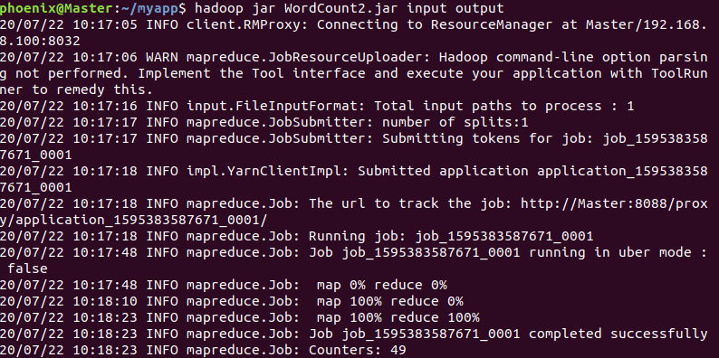
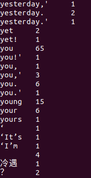
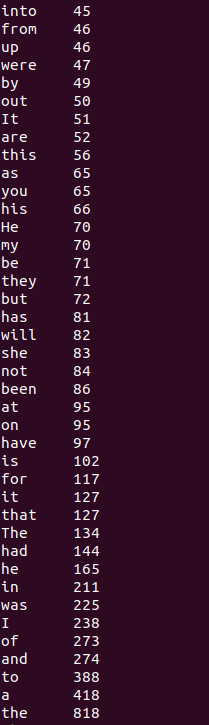
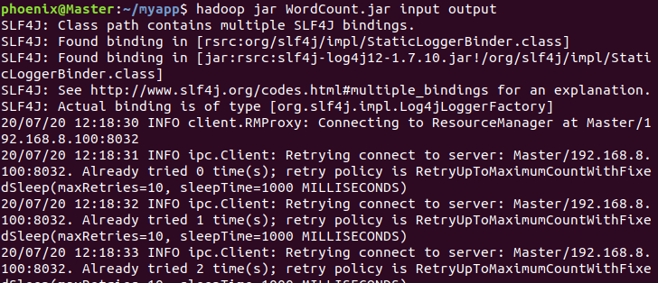
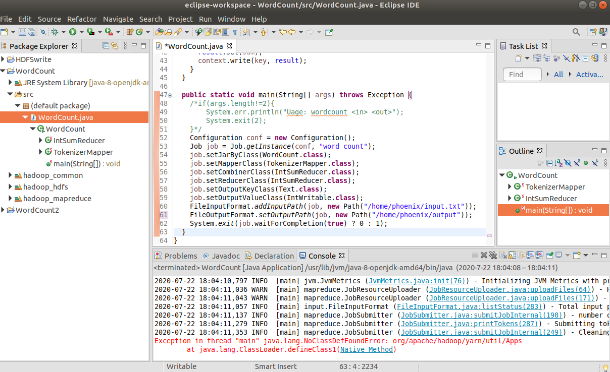
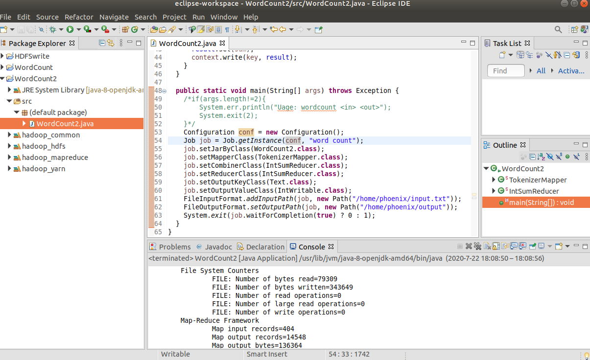
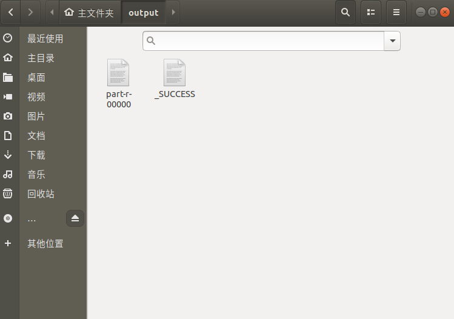

## 大数据管理技术 第二次上机

林汇平 1800013104</small>

 项目链接：<a href="https://github.com/phoenixrain-pku/BigDataSummer" target="_blank">https://github.com/phoenixrain-pku/BigDataSummer</a> </small>

+ 实习要求：每位同学在新概念英语第二册上完成 word count。

+ 报告内容：请在报告中详细写明你的实验步骤、技术方法、实习体会等，附上相应的代码段和截图。

+ 实习环境：

  虚拟机：Ubuntu 15.1.0 build-13591040

  主机操作系统：Windows 10, 64-bit (Build 17134) 10.0.17134

  内存：4GB

  硬盘：20GB

  CPU：Intel(R) Core(TM) i7-8550U CPU @ 1.80GHz(1992 MHz)

+++
1. 效果展示：

   如图为将WordCount程序打包后，在hadoop下执行成功的运行结果。可以看到终端不断更新WordCount程序执行状态。在此之后终端也打印了执行程序时读、写的文件大小。最终的output文件夹可以见压缩包，也可以见项目的Github链接。
   
   

   使用-get命令将output文件取回本地，并使用cat命令查看。由于没有使用排序，词频统计的结果比较乱。

   

   使用sort命令可以对词频按照从小到大进行排序。如图是部分频数较高的Words。

   

2. 实习过程中遇到的问题与解决方案：

   + 在hdfs下突然提示网络不可达，而此处的网络配置和之前的没有区别。尝试在Master和Slave上互ping是也发生类似错误。

     

     解决方案：首先检查自己电脑的wifi是否开启。如果已开启，检查Vmware的NAT服务是否开启。两者都开启，且虚拟机网络连接正常后，问题即解决。

   + 文件打包成功后在hdfs上执行，有如下报错。

     

     解决方案：

     上网查询此问题后并没有得到比较好的答复，看到有人说是java包冲突之类的问题。于是先放弃在hadoop上进行集群，尝试在eclipse上进行local job的测试，对代码进行调整，产生如下报错：

     

     该问题是由于没有导入yarn包所导致的。这是由于第一次安装hadoop与eclipse时，我只按照手册上导入了hdfs包与mapreduce包。因此我建了一个新的java工程，按照导入hdfs包的流程重新导入yarn包，并添加到了user library里面。再次在本地运行后，问题解决，对应路径下也出现了output文件夹。

     

     

     现在再将该java工程打包并导出，在hadoop即可正确执行，并生成output文件夹了。
