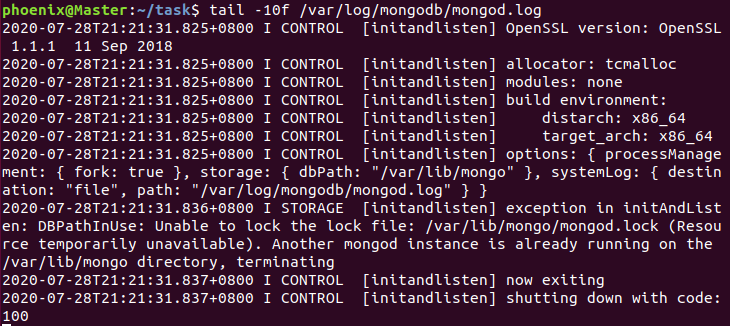
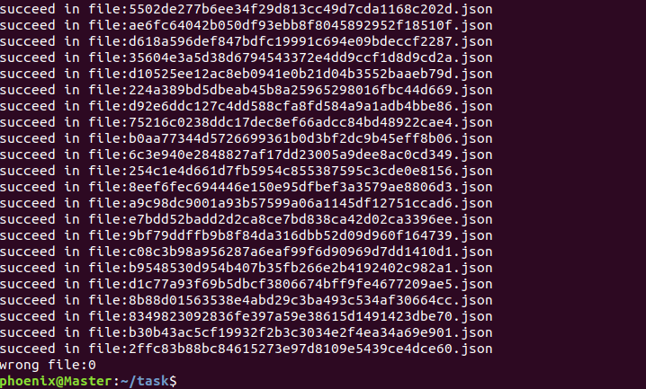

## 大数据管理技术 第五次上机

<div style="text-align: center">林汇平 1800013104</small></div>

<div style="text-align: center"> 项目链接：<a href="https://github.com/phoenixrain-pku/BigDataSummer" target="_blank">https://github.com/phoenixrain-pku/BigDataSummer</a><br /></small></div>

+ 实习要求：将CORD-19-research.zip数据集导入MongoDB并完成若干有意义的查询。

+ 报告内容：请在报告中详细写明你的实验步骤、技术方法、实习体会等，附上相应的代码段和截图。

+ 实习环境：

  + Windows环境：

    主机操作系统：Windows 10, 64-bit (Build 17134) 10.0.17134

    内存：8GB

    硬盘：256GB

    CPU：Intel(R) Core(TM) i7-8550U CPU @ 1.80GHz(1992 MHz)

  + Linux环境：

    虚拟机：Ubuntu 15.1.0 build-13591040

    主机操作系统：Windows 10, 64-bit (Build 17134) 10.0.17134

    内存：4GB

    硬盘：20GB

    CPU：Intel(R) Core(TM) i7-8550U CPU @ 1.80GHz(1992 MHz)

+++

1. 主要实现内容：

   使用python编写查询脚本文件，并在MongoDB上进行简单的查询。我在Windoes上和Linux上都分别尝试了使用MongoDB进行查询，由于我对python比较熟悉，因此使用在网上找到了python与MongoDB的教程，python撰写查询脚本。

   这里我展示了3个较有意义的查询：1. 统计论文题目中的词语出现频数，2. 统计论文摘要中的词语出现频数，3. 统计论文发表学者所属国家出现频数，并对它们进行排名前 $k$ 项的查询。

   

2. 实习成果展示：

   + Windows环境下：

     Windows环境下，MongoDB的安装比较方便一些。

     1) 下载并安装MongoDB。进入到`MongoDB\Server\4.2\bin`目录后，按照教程添加环境变量。

     2) 导入数据。不论是Windows还是Linux环境下，对于json文件，我们可以使用以下命令导入：

     `mongoimport --db test(数据库名) --collection china(集合名) --file china.json(文件名)`

     但我这里是大量的json文件构成的文件夹，上述方案不太好操作。我学习了使用python将整个文件夹导入数据集的操作。后面会写详细介绍。

   + Linux环境下：

     Linux环境下，MongoDB的安装稍微复杂一些。

     1) 下载并安装MongoDB：

     ```java
     sudo apt-get install libcurl4 openssl     
     wget https://fastdl.mongodb.org/linux/mongodb-linux-x86_64-ubuntu1604-4.2.8.tgz
     tar -zxvf mongodb-linux-x86_64-ubuntu1604-4.2.8.tgz 
     export PATH=/mongodb4/bin:$PATH
     ```

     ```java
     sudo mkdir -p /var/lib/mongo
     sudo mkdir -p /var/log/mongodb
     sudo chown phoenix /var/lib/mongo     # 设置权限
     sudo chown phoenix /var/log/mongodb	  # 设置权限
     ```

     2) 启动MongoDB服务，打开打开`/var/log/mongodb/mongod.log`文件查看是否启动成功：

     ```java
     mongod --dbpath /var/lib/mongo --logpath /var/log/mongodb/mongod.log --fork
     tail -10f /var/log/mongodb/mongod.log
     ```

   

   终端出现如上的信息说明启动成功。至此，Windows和Linux环境下的安装都已经完成。下面我展示导入数据集并实现查询的步骤。

   + 数据导入：

     1) 撰写python脚本文件，将`CORD-19-research`文件导入到MongoDB数据集中：

     ```python
     import pymongo
     import os.path
     import json
     from pymongo import MongoClient
     from pymongo import InsertOne
     
     class data_loader(object):
     	def __init__(self):
     		self.host = "localhost"
     		self.port = 27107
     
     	def loading(self,dirpath):
     		
     		connection = MongoClient('localhost')
     		db = connection.demo01
     		# create a DB instance
     		self.client = MongoClient(self.host, self.port)
     
     		#create collection
     		self.collection = self.client.DB5.data
     
     		#open file and load
     		dir = os.listdir(dirpath)
     		wrong = 0
     		for jsonname in dir:
     			file = open(dirpath + "/" + jsonname,'r')
     			jsondata = json.load(file)
     			try:
     				self.collection.insert(jsondata)
     				print("succeed in file:{}".format(jsonname))
     			except:
     				print("wrong in file:{}".format(jsonname))
     				wrong = wrong + 1
     			file.close()
     		print("wrong file:{}".format(wrong))
     
     if __name__ == '__main__':
     	loader = data_loader()
     	loader.loading("CORD-19-research")
     ```

     经过漫长的debug，导入成功，可见下图：

     

   ​	进入MongoDB的文件夹，启动mongo服务，通过`show dbs`命令可以看到数据库DB5，也就是我们刚刚创建的，其占用空间为0.026GB。

   

   4) 完成一些查询操作：

   + 1. 查询已发表的论文中，论文标题中排行前 $k$ 的词语。

     本项查询的意义很大，因为通过此项查询我们可以直观地看到学者们在此次疫情中最关注的话题。我的查询方法为：逐条取出表中记录，然后从每条记录中取出 title 字段并按照空格进行拆分得到单词，用链表title_dict记录所有在标题中出现过的单词及其出现次数，统计完成后将该链表按照单词出现次数进行排序，输出出现次数最多的五个单词。第一次写出来的python源代码如下。

     ```python
     import pymongo
     from pymongo import MongoClient
     import json
     
     if __name__ == '__main__':
     	title_dict = {}
     	collection = MongoClient()['DB5'].data
     
     	record_set = collection.find()
     	for record in record_set:
     		title = record['metadata']['title']
     		words = title.split(" ")
     		for word in words:
     			if word in title_dict.keys():
     				title_dict[word] += 1
     			else:
     				title_dict[word] = 1
     	sort_dict = sorted(title_dict.items(), key = lambda kv:(kv[1],kv[0]), reverse = True)
     	for i in range(5):
     		print(sort_dict[i])
     ```

     第一次查询结果如下：

     

     emmm……发现怎么前四个都是无意义的连词。因此需要在代码中加入排除这些无意义的连词的操作。我的实现方法为：列一个词组，里面存放我不想统计进去的词，如连词，单音节字母，标点符号，数字等，然后在查询中把它们排除。

     这次我改为查询排名前10的单词。修改之后的python源代码如下：

     ```python
     import pymongo
     from pymongo import MongoClient
     import json
     
     if __name__ == '__main__':
     	title_dict = {}
     	abandon_list = {"of", "in", "on", "From", "by", "The", "the", "a", "A", "for", "with", "to", "be", "is", "and", ",", ".", "?", "1", "2","3"}
     	collection = MongoClient()['DB5'].data
     
     	record_set = collection.find()
     	for record in record_set:
     		title = record['metadata']['title']
     		words = title.split(" ")
     		for word in words:
     			if word not in abandon_list:
     				if word in title_dict.keys():
     					title_dict[word] += 1
     				else:
     					title_dict[word] = 1
     	sort_dict = sorted(title_dict.items(), key = lambda kv:(kv[1],kv[0]), reverse = True)
     	for i in range(10):
     		print(sort_dict[i])
     ```

      第二次查询结果如下：

     

     这一次查询得到的结果还是很客观准确的。通过本项查询，我们可以大概了解关于COVID-19的研究的关注重点。

   + 2. 查询已发表的论文中，摘要中排行前 $k$ 的词语。

     类似于上一个查询，通过此项查询我们可以直观地看到学者们在此次疫情中具体关注的内容。我的查询方法为：逐条取出表中记录，然后从每条记录中取出 abstract 字段的全部内容并按照空格进行拆分得到单词，用链表abstract_dict记录所有在标题中出现过的单词及其出现次数，统计完成后将该链表按照单词出现次数进行排序，输出出现次数最多的15个单词。同样的，我也遇到了排行靠前的大部分为连词、冠词、代词等无意义词语的情况。因此本次我也构造了忽略词组，排除掉这些无意义的词语。最终的python源代码如下：

     ```python
     import pymongo
     from pymongo import MongoClient
     import json
     
     if __name__ == '__main__':
     	abstract_dict = {}
     	abandon_list = {"of", "in", "on", "From", "by", "The", "the", "a", "A", "for", "with", "to", "be","been", "is", "and", ",", ".", "?", "1", "2", "3", "that", "were", "was", "from", "we", "We", "are", "is", "this", "these", "an", "not", "or", "has", "at", "which", "when", "what", "as", "have", "can", "In", "between"}
     	collection = MongoClient()['DB5'].data
     
     	record_set = collection.find()
     	for record in record_set:
     		abstracts = record['abstract']
     		for i in abstracts:
     			abstract = i['text']
     			words = abstract.split(" ")
     			for word in words:
     				if word not in abandon_list:
     					if word in abstract_dict.keys():
     						abstract_dict[word] += 1
     					else:
     						abstract_dict[word] = 1
     	sort_dict = sorted(abstract_dict.items(), key = lambda kv:(kv[1],kv[0]), reverse = True)
     	for i in range(15):
     		print(sort_dict[i])
     ```

     查询结果如下：

     

     我们其实可以看到，这里面排行靠前的词语有部分与标题中排行靠前的词语重复。除此之外，还有很多医学类的常用名词。

   + 3. 查询所有发表论文的作者的国籍中，排名前 $k$ 的国家。

     本项查询是为了研究各国学者对于 COVID-19 的研究情况，这可以让我们最直观地认识到，不同国家的学者对疫情的关注度，以及各个国家对疫情研究所做出的贡献。

     类似于上面的查询，我撰写python脚本完成查询工作，将表中的记录逐条取出，然后从每条记录中取出authors字段，检查每篇论文每个作者的国家并加入country_dict中，country_dict 用于记录所有出现过的国家及其出现次数。统计完成后将 country_dict 按照国家出现次数进行排序，输出出现次数前15的各个国家。这里比较方便的一点是不需要排除掉无意义词语。第一次python代码如下：

     ```python
     import pymongo
     from pymongo import MongoClient
     import json
     
     if __name__ == '__main__':
     	country_dict = {}
     	collection = MongoClient()['DB5'].data
     
     	record_set = collection.find()
     	for record in record_set:
     		authors = record['metadata']['authors']
     		for author in authors:
     			if "affiliation" in author.keys():
     				affiliation = author['affiliation']
     				if "location" in affiliation.keys():
     					location = affiliation['location']
     					if "country" in location.keys():
     						country = location['country']
     						if country in country_dict.keys():
     							country_dict[country] += 1
     						else:
     							country_dict[country] = 1
     	sort_dict = sorted(country_dict.items(), key = lambda kv: (kv[1], kv[0]), reverse = True)
     	for i in range(15):
     		print(sort_dict[i])
     ```

     第一次的查询结果如下：

     

     这里我们发现，虽然查询结果与我们设想的相吻合，但有的国家以不同的名称出现了多次，如China还有可能被记作People's Republic of China与P. R. China，USA还有可能被记作United States。因此我们需要在这个地方对代码进行一点处理，即将相同国家的别名全部规范到同一个上，这样更有利于我们观察统计结果。更改后的代码如下：

     ```python
     import pymongo
     from pymongo import MongoClient
     import json
     
     if __name__ == '__main__':
     	country_dict = {}
     	collection = MongoClient()['DB5'].data
     
     	record_set = collection.find()
     	for record in record_set:
     		authors = record['metadata']['authors']
     		for author in authors:
     			if "affiliation" in author.keys():
     				affiliation = author['affiliation']
     				if "location" in affiliation.keys():
     					location = affiliation['location']
     					if "country" in location.keys():
     						country = location['country']
     						if country == "P. R. China":
     							country = "China"
     						if country == "People's Republic of China":
     							country = "China"
     						if country == "China, China":
     							country = "China"
     						if country == "United States":
     							country = "USA"
     						if country == "United Kingdom":
     							country = "UK"
     						if country in country_dict.keys():
     							country_dict[country] += 1
     						else:
     							country_dict[country] = 1
     	sort_dict = sorted(country_dict.items(), key = lambda kv: (kv[1], kv[0]), reverse = True)
     	for i in range(15):
     		print(sort_dict[i])
     ```

     第二次的查询结果如下：

     

     这一次我们可以看到同一个国家的不同别名已经被合并到一个统计条目下了。在研究积极性上中国稳居第一，美国紧随其后，剩下的国家和中美两国完全不在一个级别，可见中国、美国对疫情相关研究的重视。而实际上，前15的国家大部分都是发达国家。这也有可能是因为发达国家具有更好的科研条件。

     

3. 思考与体会：

   本次实习我主要是学习到了对MongoDB的使用，以及用python撰写数据导入与查询的脚本。由于使用python时我可以使用print函数来debug，因此调试代码的过程也容易一些。

   我也学习了使用python处理json数据集的方式，这一次我系统化地学习了python读和写json数据的方法，不过此次实习并没有涉及到写，只涉及到了读，但还是让我获益匪浅。

   在实习过程中，我发现查询的过程并不是我所设想的那么简单，因为前两个统计词频的任务中，我都遇到了频数最高的词语是无意义的连词、冠词、代词等情况。在我的实习中，我通过添加了abandon_list来舍弃这些词语，但实际上手动添加的过程比较麻烦：我每次运行一遍当前程序，在前$k$个词语中挑出我所认为的“无意义”词语，把它们加入abandon_list，然后重复上述过程，直到前$k$个词语都是有意义的。实际上如果能直接从一个“无意义词语”的词库中读入数据并进行比对，一定比我手动设置会更方便。

   类似的，在第三个任务中，我发现同一个国家存在别名，这导致我需要手动撰写国家名称规范化的特判步骤。而若我们能有一个国家别名的数据库，每次读入数据后跟别名数据库做一下对比并进行规范化，也一定比我的代码更方便一些。

   本次我们的数据集是大量json文件所构成的数据集，它相较之前处理过的数据集而言结构更加的复杂、松散，而用MongoDB去处理，更能体现了 MongoDB 的优势所在。从实习过程中可以感受到 MongoDB 对复杂数据结构的存储和查询都非常灵活，在处理数据时的速度远高于我不构造MongoDB数据库、直接读取文件存储磁盘的速度。我在网上也查询到很多夸赞MongoDB的文章，作为可扩展的高性能数据存储解决方案，MongoDB确实能在分布式存储中体现它的优势，适用于许多的应用场景。

   

