## 大数据管理技术 第五次上机

<div style="text-align: center">林汇平 1800013104</small></div>

<div style="text-align: center"> 项目链接：<a href="https://github.com/phoenixrain-pku/BigDataSummer" target="_blank">https://github.com/phoenixrain-pku/BigDataSummer</a><br /></small></div>

+ 实习要求：根据Spark安装指导安装Spark。完成如下任务：

  1. Spark RDD：对给出的莎士比亚文集Shakespere.txt进行wordcount（注：文件中包含特殊字符，请先进行过滤操作仅留下英文字符）

  2. Spark SQL： 在tmdb数据上实现的两个实用的查询功能。

  3. Spark MLlib: 使用TitanicTrainTest.zip中的训练集训练一个分类模型(比如决策树)，并且给出在测试集上的正确率。

  4. 用GraphX再次实现PageRank。

+ 报告内容：请在报告中写明技术方法及实验结果，必要时附上相应的代码段或截图。

+ 实习环境：

  Linux环境：

  虚拟机：Ubuntu 15.1.0 build-13591040

  主机操作系统：Windows 10, 64-bit (Build 17134) 10.0.17134

  内存：4GB

  硬盘：20GB

  CPU：Intel(R) Core(TM) i7-8550U CPU @ 1.80GHz(1992 MHz)

+++

1. Spark RDD：对给出的莎士比亚文集Shakespere.txt进行wordcount。

   实习成果展示：

   + 下载并安装Spark：

     ```python
     wget https://mirrors.tuna.tsinghua.edu.cn/apache/spark/spark-2.3.3/spark-2.3.3-bin-hadoop2.7.tgz
     sudo mkdir /usr/local/spark
     sudo tar zxf spark-2.3.3-bin-hadoop2.7.tgz -C /usr/local/spark
     sudo chmod -R 755 /usr/local/spark/spark-2.3.3-bin-hadoop2.7
     sudo chown -R phoenix /usr/local/spark/spark-2.3.3-bin-hadoop2.7
     ```

   + 配置Spark：

     ```python
     cd /usr/local/spark/spark-2.3.3-bin-hadoop2.7
     cp ./conf/spark-env.sh.template ./conf/spark-env.sh
     gedit ./conf/spark-env.sh
     ```

   + 安装、配置成功，开启交互模式：

     ```python
     ./bin/spark-shell
     ```

     运行成功可以看到下图，进入了Scala交互界面。

     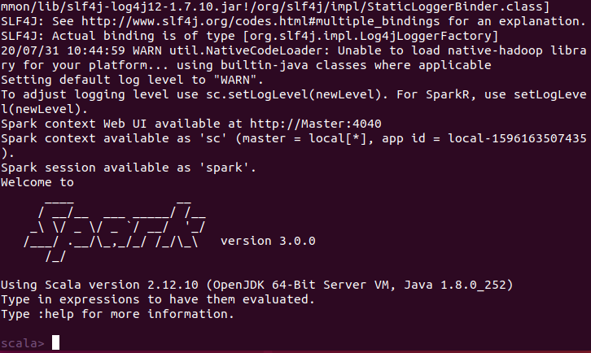

   + 导入数据集，可以在hdfs中导入、再导入Spark，也可以直接从本地导入Spark，具体如下：

     + 从hdfs中导入：
       
     
       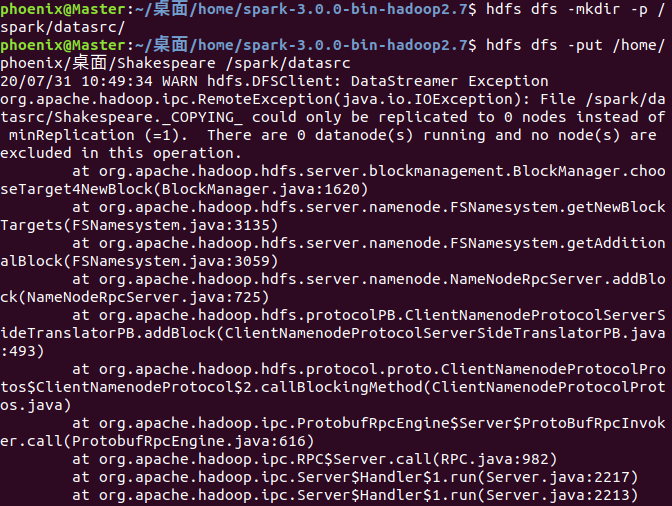
     
       通过hdfs的-ls命令可以看到数据集成功导入：
     
       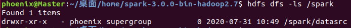
     
     + 从本地导入：
     
       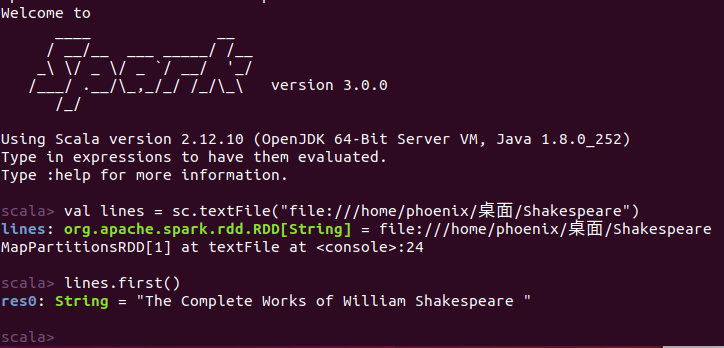
     
       可以通过scala交互中的lines.first()语句取出文件的第一行，看到我们已经正确读取了文件内容。
     
   + 完成wordcount：
   
     实习要求我们不但完成wordcount，且要先进行过滤操作仅留下英文字符。因此这个wordcount的任务实际上是需要两步来完成：1. 实现拆分（split） 2. 实现过滤（filter）。拆分可以使用split函数，非常方便；而过滤掉所有非英文字符可以通过正则表达式来实现。
   
     因此这里我使用的命令为：
   
     ```java
     val lines = sc.textFile("file:///home/phoenix/桌面/Shakespeare") 
     val wordCount = lines 
         .flatMap(line => line.split(" ")) 
         .map(word => (word.replaceAll("[^a-zA-Z]", ""),1)) 
         .reduceByKey((a, b) => a + b) 
     wordCount.collect() 
     wordCount.foreach(println)
     ```
   
     其中，`line.split`函数是为了按照空格拆分单词，`word.replaceAll`是为了过滤掉非英文字符，即使用正则表达式对特殊字符进行替换。`reduceByKey`的作用对像是(key, value)形式的rdd，其作用是对相同key的数据进行处理，最终每个key只保留一条记录。
   
     最终输出wordCount结果。
   
     运行结果如下：
     
     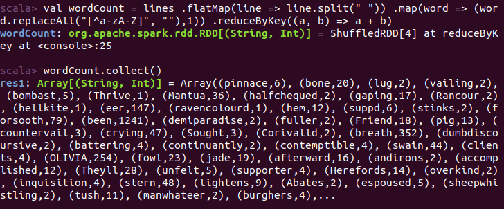
     
     使用`wordCount.foreach(println)`将词频统计结果输出到屏幕，以下为部分结果展示：
     
     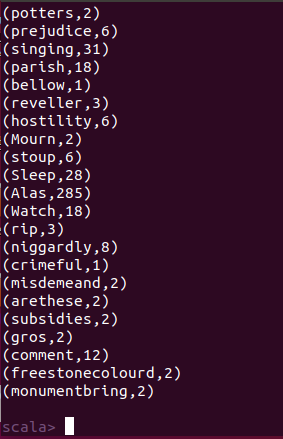
     
     
   
2. Spark SQL： 在tmdb数据上实现的两个实用的查询功能。

   实习成果展示:

   + 对数据预处理：由于`tmdb_5000_movies.csv`文件中有大量数据与多余字段，如homepage、overview等，只是对电影本身的描述，和我们做数据分析无关。因此在统计前，我们删去部分字段。这项操作在excel里就可以完成，非常方便。在本次任务中，我们只保留了original_title, revenue, vote_average, production_companies 这四列。
   
   + 利用 Spark SQL 可以快速实现在电影数据集上的过滤、筛选、分组求和：此处我继续使用python撰写脚本对数据进行处理。
   
     我想完成的查询任务为：1. 统计6.5分以上的高分电影 2. 统计收入排名前10的电影制作公司。因此我首先需要对数据做以下处理：
     
     + `df_filter=df.filter(df['production_companies']!='[]')`语句将出品公司为空的电影过滤掉；
     + `explode(split("production_companies", ",")))`语句针对一个电影有多个出品公司的情况，将出品公司按逗号拆分成多行；
     + `df_res=df_where.groupBy('production_companies_tmp').agg({"revenue":"sum"}).withColumnRenamed("sum(revenue)","sum_revenue").orderBy(F.desc('sum_revenue'))`语句按照出品公司分组求和并降序排列。
     
     最终的python代码如下：
     
     ```python
     import org.apache.spark.sql.SparkSession 
     import spark.implicits._
     
     import sys
     sys.path.append("/home/phoenix/桌面/home/spark-3.0.0-bin-hadoop2.7/python")
     
     import pyspark
     spark = pyspark.sql.SparkSession.builder.appName("SimpleApp").getOrCreate()
     sc = spark.sparkContext
     
     df = spark.read.csv('tmdb_5000_movies.csv', inferSchema = True, header = True)
     df.printSchema()
     
     df_filter = df.filter(df['production_companies']!='[]')
     #出版公司为空的电影
     
     df_whith=df_filter.withColumn('production_companies_tmp', explode(split("production_companies", ",")))
     df_whith.select('production_companies_tmp').show(10)
     #将出版公司拆为逗号分隔
     
     df_where = df_whith.where(F.col("vote_average")>'6.5')
     df_where.printSchema()
     #筛选出6.5分以上电影
     
     df_res = df_where.groupBy('production_companies_tmp').agg({"revenue":"sum"}).withColumnRenamed("sum(revenue)","sum_revenue").orderBy(F.desc('sum_revenue'))
     
     
     df_res.show(10)
     ```
     
   + 在Spark上运行python脚本：
   
     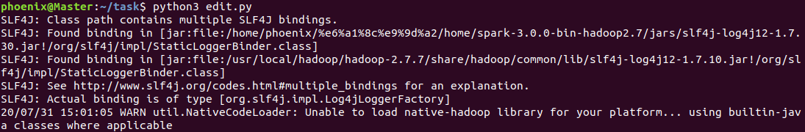
   
   + 运行结果：
   
     + 6.5分以上的高分电影展示：
   
     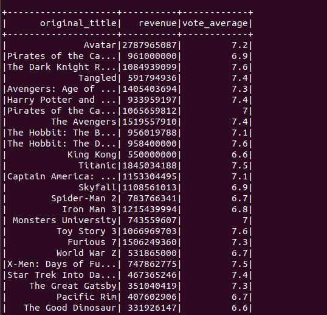
   
     + 计算所有公司高分电影收入总和，展示收入前十的公司：
   
       
   
       
   
3. 使用TitanicTrainTest.zip中的训练集训练一个分类模型(比如决策树)，并且给出在测试集上的正确率。

   实习成果展示：

   本任务工作量较大，因此需要分段展示。我们逐一进行展示。

   + 数据预处理阶段：

     由于原始数据包含很多维度，但各个字段与我们要进行的生存预测的相关度差别较大，因此先进行数据预处理，筛选出 Pclass, Sex, Age, SibSp, Parch, Fare, Embarked。因此我们筛选出相关的维度，并将数据调整为Spark MLlib读取的格式。

   + 编写 python 脚本：

     利用Spark MLlib提供的决策树分类器SVM算法，在已经进行预处理的Train数据集上运行模型，并在 Test数据集上进行测试，最终输出 Test 数据集上的accuracy。

     ```python
     from pyspark.mllib.util import MLUtils
     from pyspark.mllib.classification import SVMWithSGD
     
     import sys
     sys.path.append("/home/phoenix/桌面/home/spark-3.0.0-bin-hadoop2.7/python")
     
     import pyspark
     spark = pyspark.sql.SparkSession.builder.appName("SimpleAPP").getOrcreate()
     sc = spark.sparkContext
     
     train_data = MLUtils.loadLibSVMFile(sc = sc, path = '/home/phoenix/Desktop/trainwithlabels.csv'')
     test_data = MLUtils.loadLibSVMFile(sc = sc, path = '/home/phoenix/Desktop/testwithlabels.csv')
     
     #使用SVM算法
     
     model = SVMWithSGD.train(train_data, iterations = 100, step = 1, miniBatchFraction = 1.0)
     
     prediction = model.predict(test_data.map(lambda x: x.features)).collect()
     true_label = test_data.map(lambda x :x.label).collect()
     
     account = 0
     for index in range(len(true_label)):
     	if true_label[index] == prediction[index]:
     		account += 1
     
     print("accuracy: " + 100*account/len(true_label) + "%")
     ```
   
   +  在Spark 环境中运行脚本，结果如下：
   
     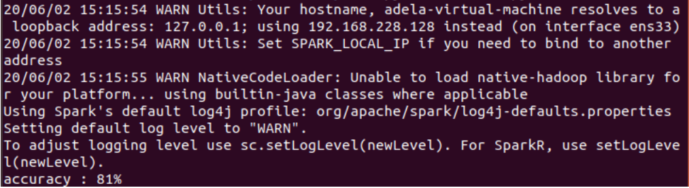
   
     可以看到：利用Spark MLlib提供的 SVM 模型，在Titanic数据集上的accuracy能够达到81%。
     
   + 还可以使用随机森林：（此部分内容与信科的吴钰晗同学讨论）
   
     ```python
     train_path='/home/phoenix/Desktop/trainwithlabels.csv'
     test_path='/home/phoenix/Desktop/testwithlabels.csv'
     # 加载csv文件
     train_rdd = sc.textFile(train_path)
     test_rdd = sc.textFile(test_path)
     def parseTrain(rdd):
         # 提取第一行的header
         header = rdd.first()
         # 除去header
         body = rdd.filter(lambda r: r!=header)
         def parseRow(row):
             # 删去双引号，根据逗号分隔
             row_list = row.replace('"','').split(",")
             # 转换成tuple
             row_tuple = tuple(row_list)
             return row_tuple
         rdd_parsed = body.map(parseRow)
         colnames = header.split(",")
         colnames.insert(3,'FirstName')
     	
         return rdd_parsed.toDF(colnames)
     
     ## Parse Test RDD to DF 
     def parseTest(rdd):
         header = rdd.first()
         body = rdd.filter(lambda r: r!=header)
         def parseRow(row):
             row_list = row.replace('"','').split(",")
             row_tuple = tuple(row_list)
             return row_tuple
     	
         rdd_parsed = body.map(parseRow)
         colnames = header.split(",")
         colnames.insert(2,'FirstName')
     	
         return rdd_parsed.toDF(colnames)
     
     train_df = parseTrain(train_rdd)
     test_df = parseTest(test_rdd)
     ```
     
     ​	合并数据，转为数值类型并填充：
     ```python
     from pyspark.sql.functions import lit, col
     train_df = train_df.withColumn('Mark',lit('train'))
     test_df = (test_df.withColumn('Survived',lit(0))
                       .withColumn('Mark',lit('test')))
     test_df = test_df[train_df.columns]
     df = train_df.unionAll(test_df)
     
     df = (df.withColumn('Age',df['Age'].cast("double"))
                 .withColumn('SibSp',df['SibSp'].cast("double"))
                 .withColumn('Parch',df['Parch'].cast("double"))
                 .withColumn('Fare',df['Fare'].cast("double"))
                 .withColumn('Survived',df['Survived'].cast("double"))
                 )
     
     numVars = ['Survived','Age','SibSp','Parch','Fare']
     def countNull(df,var):
         return df.where(df[var].isNull()).count()
     
     missing = {var: countNull(df,var) for var in numVars}
     age_mean = df.groupBy().mean('Age').first()[0]
     fare_mean = df.groupBy().mean('Fare').first()[0]
     df = df.na.fill({'Age':age_mean,'Fare':fare_mean})
     ```
     
     ​	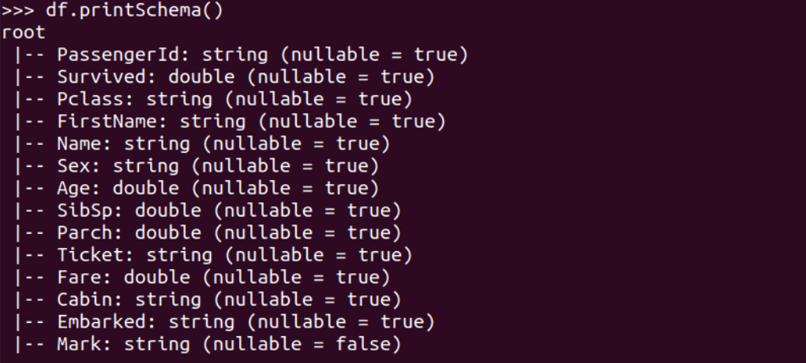
   
     ​	提取尊称：
     
     ```python
     from pyspark.sql.functions import udf
     from pyspark.sql.types import StringType
     
     gettitle = udf(lambda name: name.split('.')[0].strip(),StringType())
     df = df.withColumn('Title', gettitle(df['Name']))
     ```
     
     ​	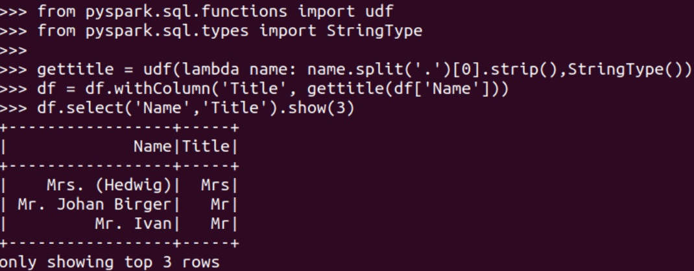	
     
     ​	特征值标签转换，并把特征转为向量：
     
     ```python
     from pyspark.ml.feature import StringIndexer
     
     catVars = ['Pclass','Sex','Embarked','Title']
     
     def indexer(df,col):
         si = StringIndexer(inputCol = col, outputCol = col+'_indexed').fit(df)
         return si
     
     indexers = [indexer(df,col) for col in catVars]
     
     from pyspark.ml import Pipeline
     pipeline = Pipeline(stages = indexers)
     df_indexed = pipeline.fit(df).transform(df)
     
     catVarsIndexed = [i+'_indexed' for i in catVars]
     featuresCol = numVars+catVarsIndexed
     featuresCol.remove('Survived')
     labelCol = ['Mark','Survived']
     
     from pyspark.sql import Row
     from pyspark.ml.linalg import DenseVector
     row = Row('mark','label','features')
     
     df_indexed = df_indexed[labelCol+featuresCol]
     lf = (df_indexed.rdd.map(lambda r: (row(r[0],r[1],DenseVector(r[2:]))))
                     .toDF())
     lf = (StringIndexer(inputCol = 'label',outputCol='index')
                     .fit(lf)
                     .transform(lf))
     ```
     
     ​	分割，并使用随机森林:
     
     ```python
     train = lf.where(lf.mark =='train')
     test = lf.where(lf.mark =='test')
     
     train,validate = train.randomSplit([0.7,0.3],seed =111)
     
     print('Train Data Number of Row: '+ str(train.count()))
     print('Validate Data Number of Row: '+ str(validate.count()))
     print('Test Data Number of Row: '+ str(test.count()))
     
     from pyspark.ml.classification import RandomForestClassifier,DecisionTreeClassifier,LogisticRegression
     
     lr = LogisticRegression(maxIter = 100, regParam = 0.05, labelCol='index').fit(train)
     rf = RandomForestClassifier(numTrees = 100, labelCol = 'index').fit(train)
     dt = DecisionTreeClassifier(maxDepth = 3, labelCol ='index').fit(train)
     
     from pyspark.ml.evaluation import BinaryClassificationEvaluator
     def testModel(model, validate = validate):
         pred = model.transform(validate)
         evaluator = BinaryClassificationEvaluator(labelCol = 'index')
         return evaluator.evaluate(pred)
     
     print('LogisticRegression'+str(testModel(lr)))
     print('DecistionTree'+str(testModel(dt)))
     print('RandomForest'+str(testModel(rf)))
     ```
     
     ​	最终训练结果：正确率达到了86%。
     
     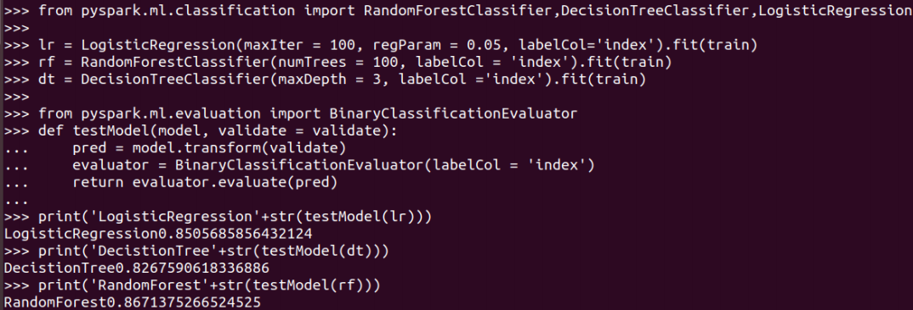
     
     
   
4. 用GraphX再次实现PageRank。

   实习成果展示：

   如图是实习要求中给出的network图片。要在这张图上实现PageRank：

   

   + 将 network 转换成edge list的形式并上传至HDFS。

     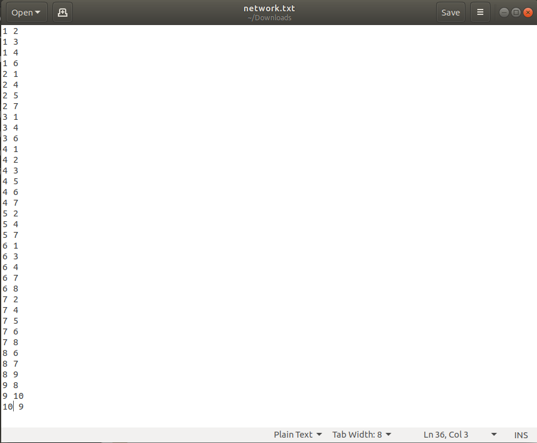

     使用`hdfs dfs -mkdir -p /spark/datasrc/`与`hdfs dfs -put network.txt /spark/datasrc/`语句，将network的edge list文件上传。

   + 启动Spark Shell，进入python环境，导入对应的包：

     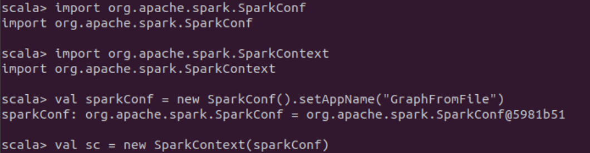

   + 导入edge list文件，并对其调用PageRank算法函数：

     在调用之前，我们首先要将network.txt导入到graph中。使用`GraphLoader`即可将之前上传至HDFS的network.txt导入graph。导入后使用命令`graph.vertices.take(10)`检查是否导入成功。若成功，即会输出如图所示的边集。

     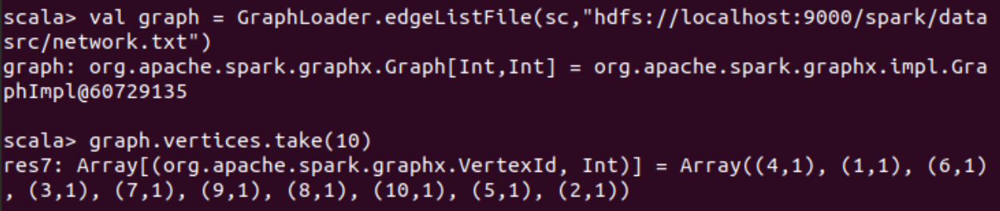

     再进行PageRank初始化操作并调用，将每个网页的初始权重设置为0.1。

     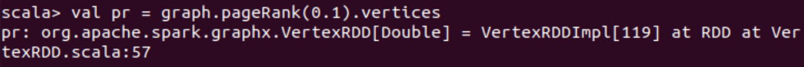

   + 输出结果：

     使用命令`pr.take(10)`即可输出运行结果：

     

   + 结果分析：

     该表格展示了实习二中的计算结果：

     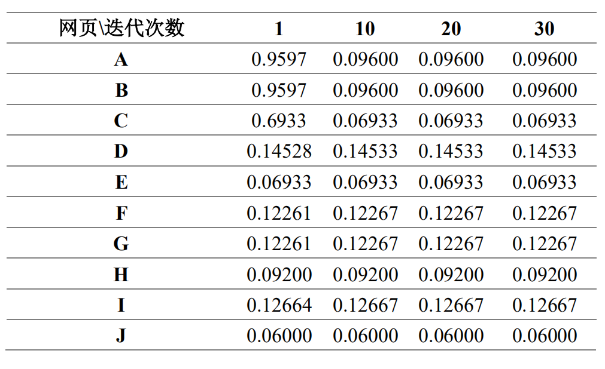

     与实习二中的计算结果进行对比，发现两次计算结果基本一致，产生的细微偏差可能是由于我们在实习二中设置的跳跃因子$\beta = 0.2$，而GraphX自带的PageRank函数源码中的默认跳跃因子被设置成了$\beta = 0.15$。

+++

心得与体会：

+ 在任务1中，我们使用Spark RDD实现了wordcount。这里我们通过简单的几行命令就完成了wordcount，且能很好地实现切分和特殊词替换。这比用java实现wordcount要便捷得多。
+ 在任务2中，我们使用Spark SQL实现了对电影数据的统计。这一部分我使用python写脚本，感觉比起直接在Spark Shell里面交互具有一定难度，但也比较方便，直接运行就可以看到想要的结果。统计结果的展示也是很清晰的。
+ 在任务3中，我们使用Spark MLlib训练了分类模型。我先使用了Spark MLlib自带的决策树分类器SVM算法。这部分通过撰写python脚本可以很方便地实现，正确率达到了81%。我又尝试了随机森林，这部分是通过直接在Spark Shell的命令行中交互，过程比较繁琐，不过正确率到了86%，效果很好。

+ 在任务4中，我们使用了GraphX自带的PageRank函数。由于GraphX的PageRank函数调用比较简单，这个实习实现起来很方便。与之前实习二中利用MapReduce编写PageRank代码相比，GraphX的函数调用方式与接口都非常简洁，参数也很好设置。考虑到实际应用在实际应用中的网络拓扑会更加庞大（节点个数更多，边也更多），在真实情况下突出 GraphX 在分布式图处理中的强大优势。

这次实习的内容很多，但是让我系统性地了解到Spark的功能，也感受到了Spark功能的丰富性。在本次实习中我们实现了wordcount、SQL、机器学习、PageRank，这些似乎完全不同的任务都可以集中在Spark上完成，正是体现了Spark的功能丰富。

